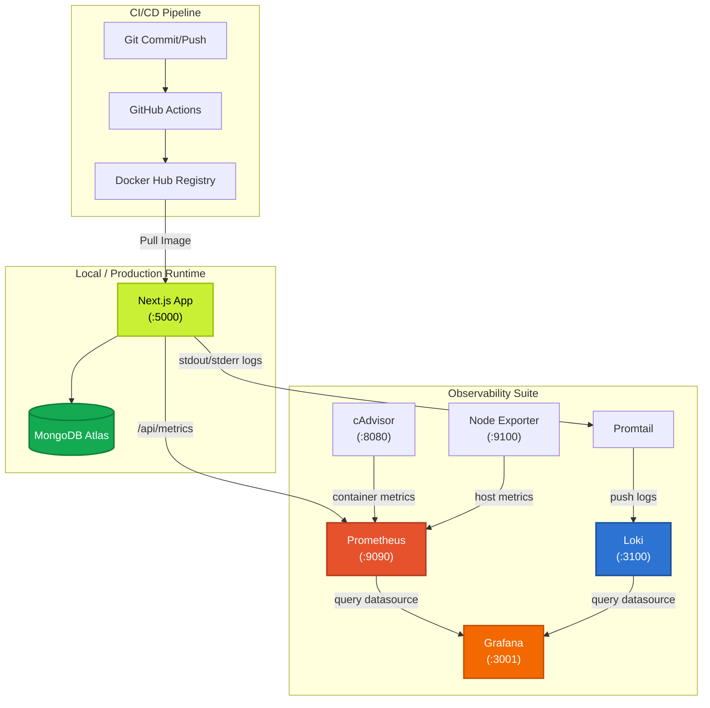

# Expenser Documentation Hub

Welcome to the official developer and DevOps documentation for **Expenser**—a modern, containerized personal finance tracker built on Next.js 16, TypeScript, MongoDB, and a production-grade Prometheus/Grafana observability stack.

---

## 🗺️ System Architecture

This diagram visualizes how the local development, production CI/CD, and the newly added monitoring services interact:



---

## 📚 Documentation Sections

To help you navigate the system, our documentation is structured into specialized guides:

### 🚀 [1. Getting Started](./getting-started.md)
*Complete local environment setup guide. Covers running the Next.js frontend, database connection parameters, and standard `npm` actions.*

### 📊 [2. Monitoring & Observability](./monitoring.md)
*Deep-dive into the Prometheus, Grafana, Loki, Promtail, cAdvisor, and Node Exporter stack. Includes pre-loaded dashboards, custom log queries, and metrics definitions.*

### 🔌 [3. API & Server Actions Reference](./api.md)
*Comprehensive documentation of the backend layer. Details Next.js Server Actions (Auth, Expenses, Settings) and the newly added Prometheus metrics scrape endpoint.*

### 🚢 [4. DevOps & Deployment](./deployment.md)
*Step-by-step instructions for Git branching, automated GitHub Actions CI/CD pipeline, Docker image publishing, and VPS production hosting.*

---

## 📂 Documentation File Tree

All manuals are organized inside the `docs/` folder at the root of the project:

```
expenser-main/
├── docs/
│   ├── README.md             # You are here (Main Hub)
│   ├── getting-started.md    # Local Setup & Environments
│   ├── monitoring.md         # Metrics & Logging Guide
│   ├── api.md                # Server Actions & API Docs
│   └── deployment.md         # CI/CD & Cloud Hosting
```
